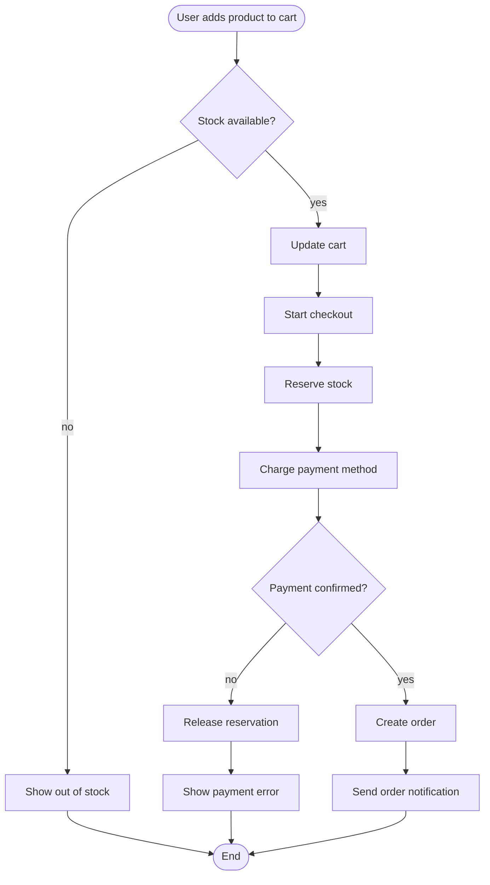

```mermaid
flowchart TD
    Start(["User adds product to cart"])

    Stock{"Stock available?"}
    Reject["Show out of stock"]
    Update["Update cart"]
    Checkout["Start checkout"]
    Reserve["Reserve stock"]
    Charge["Charge payment method"]
    Paid{"Payment confirmed?"}
    Release["Release reservation"]
    Fail["Show payment error"]
    Create["Create order"]
    Notify["Send order notification"]

    Stop(["End"])

    Start --> Stock
    Stock -->|no| Reject
    Stock -->|yes| Update
    Update --> Checkout
    Checkout --> Reserve
    Reserve --> Charge
    Charge --> Paid
    Paid -->|no| Release
    Release --> Fail
    Paid -->|yes| Create
    Create --> Notify
    Notify --> Stop
    Reject --> Stop
    Fail --> Stop
```