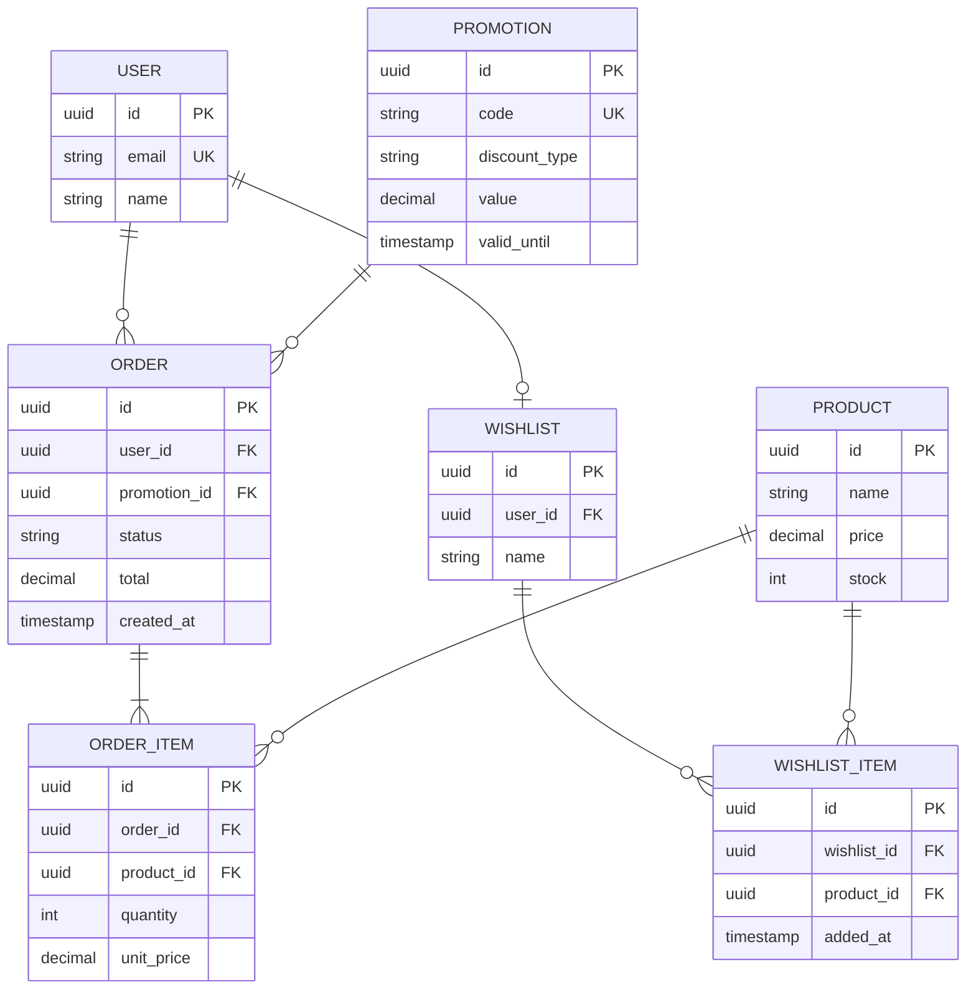

```mermaid
erDiagram
    USER ||--o{ ORDER : ""
    USER ||--o| WISHLIST : ""
    WISHLIST ||--o{ WISHLIST_ITEM : ""
    PRODUCT ||--o{ WISHLIST_ITEM : ""
    ORDER ||--|{ ORDER_ITEM : ""
    PRODUCT ||--o{ ORDER_ITEM : ""
    PROMOTION ||--o{ ORDER : ""

    USER {
        uuid id PK
        string email UK
        string name
    }
    ORDER {
        uuid id PK
        uuid user_id FK
        uuid promotion_id FK
        string status
        decimal total
        timestamp created_at
    }
    ORDER_ITEM {
        uuid id PK
        uuid order_id FK
        uuid product_id FK
        int quantity
        decimal unit_price
    }
    PRODUCT {
        uuid id PK
        string name
        decimal price
        int stock
    }
    WISHLIST {
        uuid id PK
        uuid user_id FK
        string name
    }
    WISHLIST_ITEM {
        uuid id PK
        uuid wishlist_id FK
        uuid product_id FK
        timestamp added_at
    }
    PROMOTION {
        uuid id PK
        string code UK
        string discount_type
        decimal value
        timestamp valid_until
    }
```